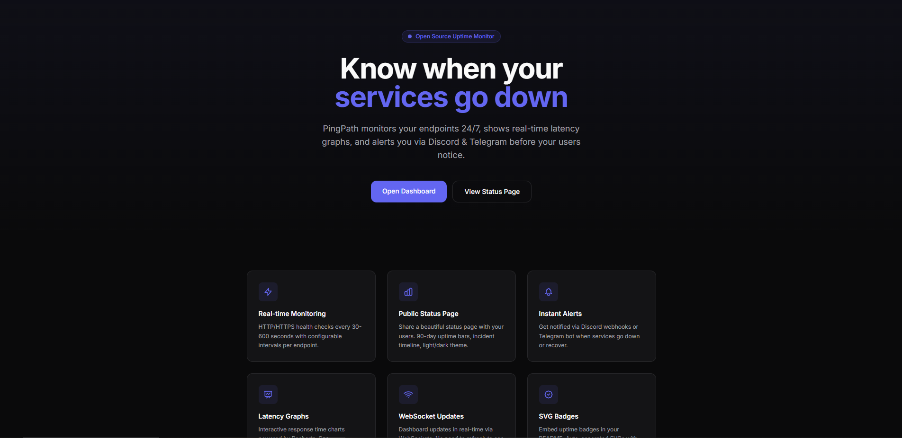
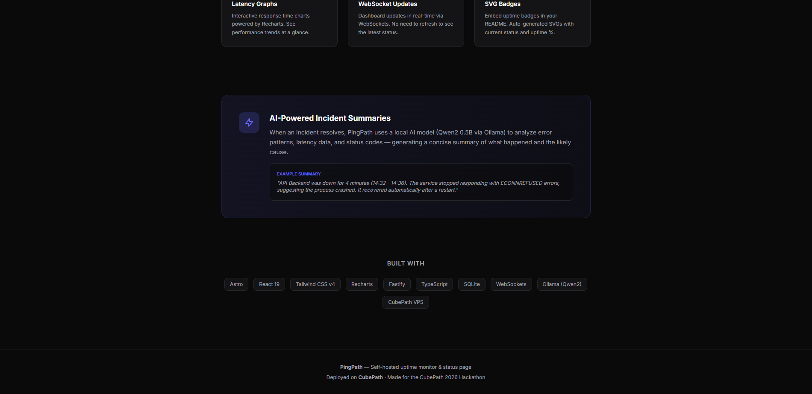
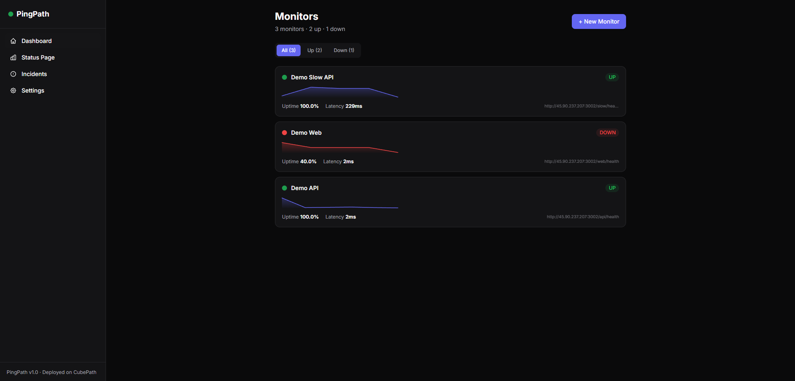
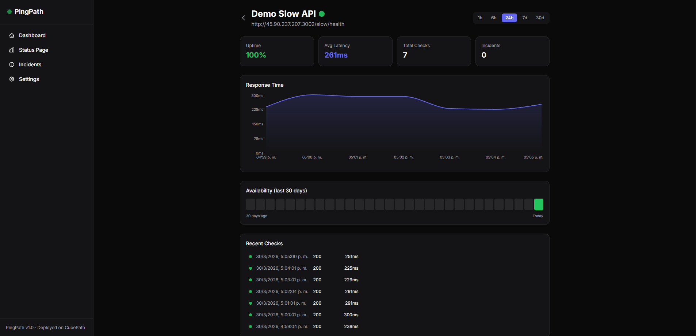
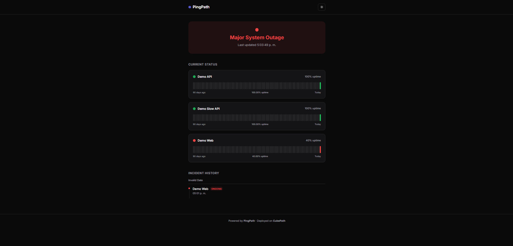
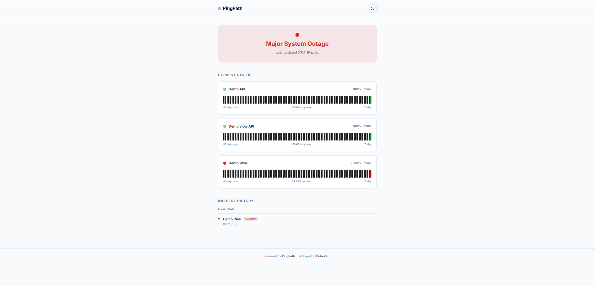

# PingPath

**Uptime Monitor & Status Page** - Monitor your services, visualize performance, and share public status pages.

Built for the [CubePath Hackathon 2026](https://github.com/midudev/hackaton-cubepath-2026) by [@carmegar](https://github.com/carmegar).

## Live Demo

> **Live:** [http://45.90.237.206](http://45.90.237.206)
> **Status Page:** [http://45.90.237.206/status](http://45.90.237.206/status)
> **Dashboard:** [http://45.90.237.206/app](http://45.90.237.206/app)

## Screenshots

### Landing Page



### Dashboard


### Monitor Detail


### Status Page



## Features

- **Real-time monitoring** - HTTP/HTTPS health checks every 60 seconds
- **Interactive dashboard** - Latency charts, uptime percentages, sparkline graphs
- **Public status page** - 90-day uptime bars, incident timeline, light/dark theme
- **AI incident summaries** - Automatic post-incident analysis via Ollama (Qwen2 0.5B)
- **Incident tracking** - Automatic detection of outages and recoveries
- **Notifications** - Alerts via Discord webhooks and Telegram bots
- **Demo services** - 3 mock microservices with chaos engine for live demos
- **Embeddable badges** - SVG status badges for your README
- **WebSocket updates** - Dashboard refreshes in real-time without polling
- **Dark/Light theme** - Modern, clean UI with theme toggle

## Tech Stack

| Layer | Technology |
|-------|-----------|
| Frontend | Astro + React + Tailwind CSS v4 |
| Charts | Recharts |
| Backend | Node.js + Fastify + TypeScript |
| Database | SQLite (@libsql/client) |
| Real-time | WebSockets (@fastify/websocket) |
| AI | Ollama + Qwen2 0.5B |
| Cron | node-cron |
| Deploy | **CubePath VPS** (2x VPS Nano) |

## How CubePath is Used

PingPath runs on **2 CubePath VPS Nano instances**:

| VPS | Role | Details |
|-----|------|---------|
| **VPS 1** (45.90.237.206) | PingPath App | API + Frontend + Nginx + Ollama |
| **VPS 2** (45.90.237.207) | Demo Services | 3 mock microservices + chaos engine |

The main VPS hosts the Fastify API and Astro frontend behind Nginx. It runs cron jobs every 60 seconds that check the health of monitored endpoints and stores results in SQLite. WebSocket connections stream real-time updates to connected dashboards. The second VPS runs demo services with a chaos engine that randomly degrades or takes down services every 10-20 minutes, showcasing PingPath's monitoring capabilities in action.

This architecture requires persistent servers running 24/7 — exactly what CubePath VPS provides.

## Getting Started

### Prerequisites

- Node.js 20+
- pnpm 9+

### Installation

```bash
# Clone the repository
git clone https://github.com/carmegar/pingpath.git
cd pingpath

# Install dependencies
pnpm install

# Copy environment variables
cp .env.example .env
cp apps/web/.env.example apps/web/.env
```

### Development

```bash
# Run both frontend and backend in parallel
pnpm dev

# Or run them separately
pnpm dev:api   # Backend on http://localhost:3001
pnpm dev:web   # Frontend on http://localhost:3000
```

### Build

```bash
pnpm build
```

## API Endpoints

| Method | Endpoint | Description |
|--------|----------|-------------|
| GET | `/api/monitors` | List all monitors |
| POST | `/api/monitors` | Create a monitor |
| GET | `/api/monitors/:id` | Get monitor details |
| PUT | `/api/monitors/:id` | Update a monitor |
| DELETE | `/api/monitors/:id` | Delete a monitor |
| GET | `/api/monitors/:id/checks` | Check history |
| GET | `/api/monitors/:id/stats` | Monitor statistics |
| GET | `/api/status` | Public status data |
| GET | `/api/status/badge/:id` | SVG status badge |
| GET | `/api/incidents` | Incident history |
| POST | `/api/incidents/:id/summarize` | Generate AI summary |
| WS | `/ws` | Real-time events |

## Project Structure

```
pingpath/
├── apps/
│   ├── api/              # Fastify backend
│   │   └── src/
│   │       ├── ai/              # Ollama AI summarizer
│   │       ├── cron/            # Health check scheduler
│   │       ├── db/              # SQLite schema
│   │       ├── notifications/   # Discord & Telegram
│   │       ├── routes/          # REST API
│   │       └── ws/              # WebSocket broadcaster
│   ├── demo-services/    # Mock services + chaos engine
│   └── web/              # Astro frontend
│       └── src/
│           ├── components/      # React components
│           ├── hooks/           # Custom hooks (useWebSocket)
│           ├── layouts/         # Astro layouts (App + Public)
│           ├── lib/             # API client
│           └── pages/           # Astro pages
├── docs/                 # Project documentation
├── screenshots/          # App screenshots
└── README.md
```

## License

MIT
